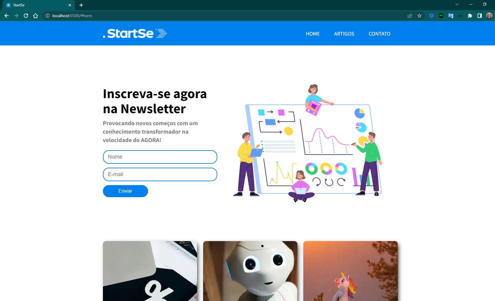
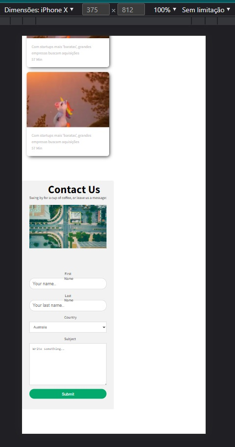

<h4 align="center"> 
	🚧 Meu Blog 🚀
</h4>

<h1 align="center">
    
</h1>

- Projeto de um site institucional dos meus conteúdos.

#### Requisitos

- [ ] design personalizado
- [ ] responsividade
- [x] favicon
- [x] logo e nome
- [ ] estilizar página de item
- [ ] personalizar página dinamicamente
- [ ] conteúdo de cards em objeto

#### Telas

- Desktop

    

- Mobile

    

#### Inspirações para aperfeiçoamentos  

- Funcionalidades de um site bom